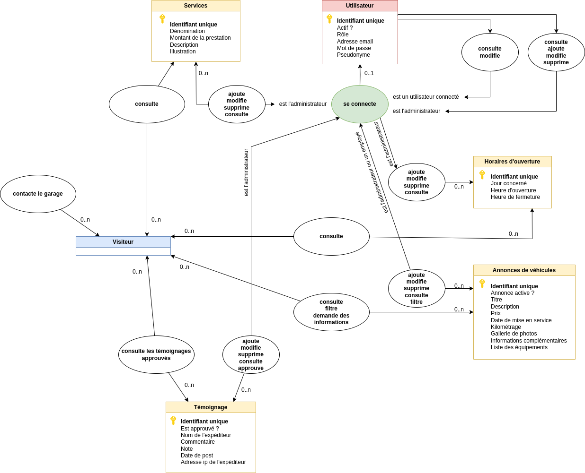

# ÉVALUATION EN COURS DE FORMATION
## Graduate Développeur
###### (Android, Angular, Flutter, Front End, Full Stack, IOS, PHP/Symfony)

---

## Énoncé

**Votre examen comporte :**

✔ Cet énoncé qui vous présente le sujet de l’épreuve

✔ Une copie à rendre (Excel ou Word) que vous devez télécharger, remplir informatiquement et déposer dans l’espace de dépôt prévu à cet effet.


**Renommer votre copie à rendre Word ou Excel comme suit :**
ECF_NomParcours _copiearendre_NOM_Prenom

**Objectifs de l’évaluation :**
L’évaluation en cours de formation que vous allez réaliser a pour vocation de figurer dans votre livret d’évaluation. Il sera donc remis à votre jury le jour des épreuves du titre professionnel accompagné de votre évaluation et du sujet initial.
Nous vous demandons de vous mettre en situation d’examen. Prenez le temps de lire le sujet et de manipuler les annexes afin de répondre en situation professionnelle aux questions et problématiques évoquées dans le sujet


### À vous de jouer !


---

## Informations

**Github** : https://github.com/pantaflex44/ECF_Graduate-DEV-PHP-Symfony_MONTAGNIER_copiearendre_LEMOINE_Christophe

**Démonstration** : <span style="color:red">**url du site**</span>

    Adresse email démo      : admin@garage-vparrot.com
    Mot de passe démo       : admin

**Trello** : <span style="color:red">**url du trello**</span>


---

## Réflexion et configuration de l'environement de travail

### <span style="text-decoration:underline">Résumé du besoin et choix des technologies</span>

Monsieur Parrot à un besoin en réalité plutôt simple. Un site vitrine dans lequel vont devoir s'afficher des informations statiques, et pas mal d'informations dites dynamiques.

Le client à besoin de sécuriser l'accès aux modifications des données, et d'attribuer 2 rôles: Lui, l'administrateur, et un deuxième rôle pour ses employés.

Mr Parrot souhaite par ailleurs mettre en évidences la liste des véhicules qu'il propose à la vente. Liste complètement dynamique et interractive avec la meilleurs expérience utilisateur possible pour se démarquer de ses concurrents.

Plusieurs choix s'offrent à moi quand aux technologies à employer. Le site, résultat final, est relativement simple. Une première idée serait d'utiliser un framework de type Symfony pour arriver à mes fins. Un peu de javascript pour les interractions avec le visiteur et le tour est joué.

Mais après réflexion, Mr Parrot souhaite réellement se moderniser. Souhaite réllement faire entrer son garage dans l'air du temps et affronter sa concurrence. Donc m'est venu l'idée que Mr Parrot déciderai peut être un jour de créer, en plus, une application mobile, ou proposer un système interractif, type panneau d'affichage tactile, pour mettre en avant ses services et véhicules.

En clair des données et de multiples accès différents à celles-ci.

Donc la solution, API pour le Backend et une interface interractive autonome pour le Frontend s'est tout de suite imposée. 

Du coté de l'API, tous frameworks plus ou moins dédiés et languages de programmation web peuvent faire l'affaire. De FastAPI, en passant par API Plateform, puis Fastify, ou encore du code maison, le choix est vaste.

Pour le language utilisé pour le Backend, le PHP s'est imposé. Language que je connais depuis sa version 3, language très utilisé de nos jours, et des serveurs pouvant être simples à configurer. Les données seront confiées à MySQL pour répondre au besoin de l'examen. De ce choix, me voila à la recherche d'une tecnologie pour développer mon API.

Ayant récement découvert `Slim PHP`, je me tourne naturellement vers ce framework. Bien plus léger que Symfony, bien plus agréable et performant, je trouve ce choix cohérent. Adopté!

Pour la partie Frontend, le choix a été bien plus facile. Fervant passionné de `ReactJs`, il était assuré que j'emploie cette technologie pour développer cet examen. En plus ça tombe très bien car celà ma permet de réaliser une interface graphique Web et Web mobile de qualité, dynamique et à l'expérience utilisateur de qualité pour le projet de Mr Parrot ;-)
Je n'oublie par le couple HTML 5 et CSS 3 pour architecturer proprement les pages Web, tout en les mettant en beauté facilement.

Deplus, comme écrit plus haut, `ReactJs` peut être facilement adapté en `React Native` pour créer une application mobile par exemple!

Ceci donc, pour les grandes lignes quand à mes choix technologiques.

### <span style="text-decoration:underline">Configuration de l'environement de travail</span>

Travaillant sur un système d'exploitation de type `Linux`, les informations ci-dessous y seront bien évidement destinées.

Les commandes sont à titre d'exemple. Elles devront être adaptées au système d'exploitation utilisé. Ici, je représenterai les bases `Debian`.

- **Serveur:**
    + Apache
    + PHP 8.1
    + MySQL 8.1 / PDO


- **Backend (API)**
    + PHP 8.1
    + MySQL 8.0 / PDO
    + Slim 4


- **Frontend**
    + HTML 5
    + CSS 3
    + Javascript
    + ReactJs


---

## Utilisation

### <span style="text-decoration:underline">Installer l'application en local</span>

- **Que la lumière fût: *LAMP* (ou *XAMP* pour Windows)**

    LAMP est un acronyme pour Linux, Apache, MySQL, PHP. C'est une pile logicielle comprenant le système d'exploitation, un serveur HTTP, un système de gestion de bases de données et un langage de programmation interprété, et qui permet de mettre en place un serveur web.

    Pour installer *LAMP* rien de plus simple. Nous allons procéder à l'installation des paquets à jour de votre distribution Linux:

    ```bash
    $ sudo apt update
    $ sudo apt install apache2 php libapache2-mod-php mysql-server php-mysql
    $ sudo apt install php-curl php-gd php-intl php-json php-mbstring php-xml php-zip php-mysql
    ```

    Petites vérifications rapides:

    ```bash
    $ php -v
    $ mysql -v
    ```

    Et voila ! Un tour sur http://127.0.0.1/ vous emmenera sur la page d'accueil de votre nouveau serveur Web.

    Pour la suite des configurations et personnalisations, je vous propose de vous rendre sur le Didactitiel suivant: https://doc.ubuntu-fr.org/lamp

- **Installer les dépendances: *Composer* et *NodeJs***

    <span style="text-decoration:underline">*Installer Composer*</span>

    Pour rappel toutes les lignes de commandes sont pour linux (pour une autre plateforme, veuillez suivre les instructions sur le site web du concepteur).

    Tout d'abord, direction le dossier utilisateur:

    ```bash
    $ cd ~
    ```

    puis, téléchargement de composer:

    ```bash
    $ curl -sS https://getcomposer.org/installer -o /tmp/composer-setup.php
    ```

    ensuite, récupération et enregistrement de la signature du paquet récupéré, puis vérification de celui-ci:

    ```bash
    $ HASH=`curl -sS https://composer.github.io/installer.sig`
    $ php -r "if (hash_file('SHA384', '/tmp/composer-setup.php') === '$HASH') { echo 'Installation verifiee'; } else { echo 'Installation corrompue'; unlink('composer-setup.php'); } echo PHP_EOL;"
    ```

    si tout est OK, la console devrait renvoyer:

    ```bash
    Installation verifiee
    ```

    il ne reste plus qu'a installer le paquet ```Composer```:

    ```bash
    $ sudo php /tmp/composer-setup.php --install-dir=/usr/local/bin --filename=composer
    ```

    la console indique le suivi de cette installation. Pour vérifier que l'installation s'est déroulée avec succès, tapez la commande suivante:

    ```bash
    $ composer
    ```

    la console affiche désormais l'aide de ```Composer``` ! Cette étape est donc un succès. Passons à la suite.

    <span style="text-decoration:underline">*Installer NodeJs*</span>

    Cette fois, je vous conseille fortement de suivre la procédure directement sur le site de ```NodeJs```: https://nodejs.org/en/download/package-manager

    NodeJs peut être compliqué à installer, tout au moins, avoir la dernière version disponible sur son ordinateur. C'est pourquoi, plusieurs méthodes sont directement proposées par le concepteur.

    Néanmoins, quelques vérifications après installation, sont les bienvenues:

    ```bash
    $ node -v
    $ npm -v
    ```

- **Et le projet ? Ce fournir à la source: *Github***

    Désormais il va falloir récupérer le projet de cet ECF pour l'installer sur votre machine.

    Pour ce faire, encore une fois, rien de plus simple.

    1) Téléchargez le ZIP: https://github.com/pantaflex44/ECF_Graduate-DEV-PHP-Symfony_MONTAGNIER_copiearendre_LEMOINE_Christophe/archive/refs/heads/main.zip
    2) Décompressez le fichier obtenu en lieu de place
    3) Renommez le dossier obtenu par commodité (totalement optionnel)
    4) Ouvrez le dossier obtenu

    Vous trouverez dans ce dossier l'intégralité des fichiers du projet. Toutefois, en l'état rien n'est fonctionnel!

    *Commençons par l'API.*

    ```bash
    $ cd api
    $ composer install
    ```

    Ces lignes de commandes lancent l'installation des dépendances liées à l'API ! ```Composer``` éxécute le script intégré au projet pour récupérer toutes les dépendances nécessaires à son fonctionnement.

    ```bash
    $ cd ..
    ```

    Pour revenir au dossier parent.

    *Suivons par l'interface graphique*

    ```bash
    $ cd ui
    $ npm install
    ```

    Comme pour ```Composer```, ```Node JS``` installée plus haut, vient télécharger les dépendances nécessaires au fonctionnement de l'interface graphique.    

    Et voila ce sera tout pour la partie *installation du projet en local* ! :-)


- **Configuration de l'application: *les variables d'environement***

    A la racine du projet, créez un fichier `.env`. Ce fichier contiendra les paramètres fonctionnels de l'application.

    Regardons ensemble les paramètres importants pour exécuter convenablement le projet:

    ```bash
    # Permet d'initialiser pour la premère fois l'application.
    # Par défaut ce paramètre est à TRUE
    FIRST_RUN=true

    # Active le mode debuggage.
    # Par défaut ce paramètre est à FALSE
    DEBUG=false

    # Nom du garage
    SITENAME=Garage V. Parrot

    # Adresse email du garage
    EMAIL=admin@garage-vparrot.com

    # Informations pour la connexion à la base de données.
    MYSQL_HOST=localhost
    MYSQL_PORT=3306
    MYSQL_USER=user
    MYSQL_PASS=Mstr08pir.
    MYSQL_BASE=gvp

    # Informations relatives à la sédcurisation de l'accès à l'API
    JWT_SECRET=zQA7LS5GY8i8HvKTBqVPVge2PGq9veow
    JWT_ALGO=HS256
    JWT_LIVE=3600

    # ...
    ```

    Lors du premier lancement de l'application, indiquez `true` comme valeur du paramètre `FIRST_RUN` et `false` comme valeur du paramètre `DEBUG`.

    + **Base de données**

        Indiquez les informations de connexion à la base de données, à savoir l'adresse du serveur (défaut: localhost), le port utilisé (défaut 3306), le nom d'utilisateur et le mot de passe de connexion.

        Le nom de la base de données est `gvp` (pour Garage V.Parrot). Rien ne vous empèche de le modifier.

    + **Accès à l'API**

        La pluspart des fonctionnalités proposées par l'API sont accessible seulement par un utilisateur connecté, soit un administrateur, soit un employé. Pour protéger ces accès, un jeton d'authentification est alors créé et utilisé tout au long de la durée de connexion de l'utilisateur.

        Ce jeton est sécurisé, notament par une clef secrète modifiable via le paramètre `JWT_SECRET`. <span style="color:red">Il est impératif de ne pas utiliser la clef indiquée par défaut!</span>

        Pour ce faire, vous pouvez utiliser le site https://randomkeygen.com/ pour générer aléatoirement une clef secrète. Par exemple, utilisez une clef générée sous la rubrique `CodeIgniter Encryption Keys`.

    Une fois ces paramètres indiqués, ouvrez votre naviguateur et accédez à l'URL: http://localhost:8080/api (sans le / à la fin). Un texte du genre `Garage V. Parrot API v0.1 by Christophe LEMOINE - Copyright (c)2023` devrait apparaitre à l'écran. Bravo, vous avez initialisé l'application!

    Revenez dans le fichier `.env` puis modifiez la valeur du paramètre `FIRST_RUN` pour indiquer `false`. Voilà, votre application est désormais opérationnelle!

- **Rien que pour vos yeux: *compilation de l'interface graphique***

- **Envole toi petit colibri: *déploiement / éxécution***
    
- **Essai et Connexion de l'administrateur par défaut**


### <span style="text-decoration:underline">Création d'un compte administrateur</span>

Le compte administrateur est automatiquement créé lors de l'initialisation de la base de données (data.sql).

Les données de connexion par défaut sont:

    Adresse email       : admin@garage-vparrot.com
    Mot de passe        : admin

<span style="color:red">**Utilisateurs expérimentés seulement:**</span>

Pour mofifier le compte `Administrateur` par défaut vous pouvez modifier les informations se trouvant à la ligne 14 du fichier `data.sql`:

```sql
INSERT INTO users (active, role, email, password, display_name) VALUES (1, 'admin', 'admin@garage-vparrot.com', SHA2('admin', 512), 'Administrateur');
```

**ATTENTION**: Ne pas faire n'importe quoi sous peine de casser le fonctionnement de l'application. Un système plus sécurisé devra être mis en place à l'avenir. Cette façon de faire n'est qu'à titre de solution de secours pour l'examen.

    (..., 'admin@garage-vparrot.com', SHA2('admin', 512), 'Administrateur')

Voici les 3 informations modifiables:

    'admin@garage-vparrot.com'  : représente l'email de contact et de connexion de l'administrateur
    'admin'                     : représente le mot de passe par défaut
    'Administrateur'            : représente le nom visuel donné à l'administrateur

Les **''** entourant les données modifiables sont importantes. **Ne modifier que le contenu qui ne devra lui, pas en posséder!**

`SHA2('admin', 512)` est la méthode employée pour sécuriser le mot de passe en base de données. En gros, cette méthode ne stock que le haschage du mot de passe. Non seulement vous ne pourrez pas retrouver un mot de passe perdu, mais cette méthode ne devra pas être modifiée dans cette configuration sous peine de casser l'API.


---
<span style="color:red">**FICHIER documentation_technique.pdf**</span>


## Spécifications techniques

**Serveur:**
- Apache
- PHP 8.1
- MySQL 8.1 / PDO

**Backend (API)**
- PHP 8.1
- MySQL 8.0 (PDO)
- Slim 4 (CORS, HTTPS, GZIP, JSON, JWT)

**Frontend**
- HTML 5
- CSS 3
- Javascript
- ReactJs (NodeJs 20 / NPM 9)


## Diagramme des Cas d'utilisations

<br />


<br /><br />


## Modélisation des données

Comme indiqué dans l'énoncé de l'examen, aucune des fonctionnalités demandées par Mr Parrot, mais surtout la manière de s'en servir de requiert de liens particuliers entre les différentes données.

C'est pourquoi, aucune liaison / relation ne sera représentée sur la modélisation des données.


<br />


## Diagramme de Merise

<br />



<br /><br />


## Diagrammes de séquence

### <span style="text-decoration:underline">Connexion d'un utilisateur</span>

<span style="color:red">**diagramme de séquence**</span>

### <span style="text-decoration:underline">Modification d'un employé</span>

<span style="color:red">**diagramme de séquence**</span>

### <span style="text-decoration:underline">Découverte de la liste des véhicules d’occasion</span>

<span style="color:red">**diagramme de séquence**</span>


### <span style="text-decoration:underline">Filtrer la liste des véhicules selon ses critères</span>

<span style="color:red">**diagramme de séquence**</span>


### <span style="text-decoration:underline">Remplir le formulaire pour en savoir plus à propos d’une voiture en particulier</span>

<span style="color:red">**diagramme de séquence**</span>


---
<span style="color:red">**FICHIER charte_graphique.pdf**</span>


## Charte graphique

### <span style="text-decoration:underline">Polices d'écritures</span>

<span style="color:red">**nom, url et licence**</span>


### <span style="text-decoration:underline">Palettes de couleur</span>

<span style="color:red">**planche de palettes de couleur**</span>


### <span style="text-decoration:underline">Logo</span>

<span style="color:red">**logo du garage**</span>


## Maquettes pour le site web

### <span style="text-decoration:underline">Wireframe version Mobile</span>

<span style="color:red">**wireframe mobile**</span>


### <span style="text-decoration:underline">Wireframe version Web</span>

<span style="color:red">**wireframe web**</span>


